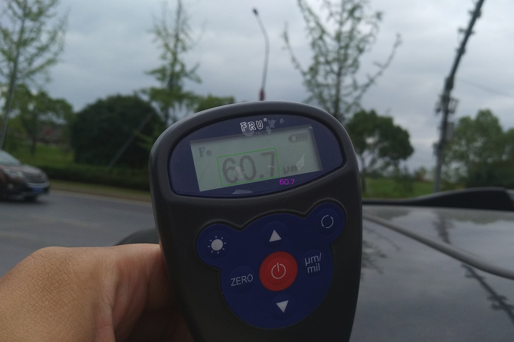
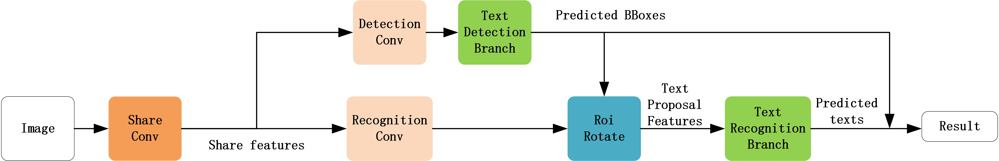

# FOTS
[TOC]

This project is based on FOTS implemented by [Ning Lu](https://github.com/jiangxiluning) as well as [DongLiang Ma](https://vipermdl.github.io/) and other excellent open source projects. **Gratitude to all contributors to open source projects.**

## Identification sample [continuous update]

### Scenario 1: specific portions of text




## HOW TO RUN
### Global parameter configuration

|       Field       |         Role         |          Reference Value          |                      Comment                      |
| :---------------: | :------------------: | :----------------------: | :--------------------------------------------: |
|       name        |       name of project       | FOTS_2019-05-11_own_dataset |                   as you like                   |
|       cuda        |     whether to use video card     |           true           |                 use it if you can                 |
|       gpus        |  configure multiple graphics cards for parallel training  |           [0]            | `nvidia-smi` and look at the id of the video cards you want to use |
|     finetune      |       finetune       |            ""            |          must finetune the model with the same mode          |
|    data_loader    |      dataset configuration      |       see below for details       |                                                |
|    validation     |      validation dataset configuration      |       see below for details       |                                                |
| lr_scheduler_type |    learning rate scheduler type    |      ExponentialLR       |         linear,exp,custom,etc.         |
| lr_scheduler_freq |    learning rate scheduler frequency    |            50            |           adjust according to the convergence rate of the model           |
|   lr_scheduler    |       hyper-parameter of learning rate scheduler        |                          |          pass parameters according to the scheduler type          |
|  optimizer_type   |      optimizer type      |           Adam           | optimizer types supported by PyTorch |
|     optimizer     |    hyper-parameter of specific optimizer    |                          |          pass parameters by yourself, depending on the optimizer type          |
|       loss        |       loss function name       |         FOTSLoss         |              only the `FOTSLoss` support now              |
|      metrics      |       metric names       |       fots_metrics       | both recognition_metric and detection_metric are not complete |
|      trainer      |      trainer configuration      |       see below for details       |                                                |
|       arch        |       name of algorithm architecture       |        FOTSModel         |               only FOTSModel               |
|       model       |   hyper-parameter of FOTSModel   |       see below for details       |               **will update frequently**               |

### dataset configuration 【data_loader】

|Field|Role|Reference value|Comment|
|:--:|:--:|:--:|:--:|
|dataset|type of dataset|icdar2015、mydataset| If your data format is special, add to `data_loader\dataset.py` |
|data_dir|path to the data folder|trainging_gt,training_images|he folder must contains images folder and the ground truth folder|
|annotation_dir|path to the annotation data folder|training_gt|*NOT COMPLETE*|
|batch_size|batch size|32|according to personal circumstances|
|shuffle|whether to shuffle the data|true|true|
|workers|workers to generate data|0|1. The environment parameters need to be passed in the docker, otherwise an error will be reported<br />2. If `get_item` is inefficient, it is highly recommended to open more or the gpu will be idle.|


#### ICDAR2015

Modify the configuration file as follows：
```json
{
    "data_loader": {
        "dataset":"icdar2015",
        "data_dir": "/mnt/disk1/dataset/icdar2015/4.4/training",
        "batch_size": 16,
        "shuffle": true,
        "workers": 0 
    }
}
```
#### mydataset
Modify the configuration file as follows：
```json
{
  "data_loader": {
        "dataset":"mydataset",
        "image_dir": "/data/OCR/owndataset/own_dataset/training_images",
        "annotation_dir": "/data/OCR/owndataset/own_dataset/training_gt",
        "batch_size": 4,
        "shuffle": true,
        "workers": 0
    }
}
```

#### validation dataset configuration【validation】

```json
"validation": {
    "validation_split": 0.15,
    "shuffle": true
}
```

Since training and testing are conducted in a fixed proportion, where 'validation_split' indicates the proportion of test set, 'shuffle' means whether to reorder.

#### hyper-parameter of trainer【trainer】

```json
"trainer": {
    "epochs": 10000,
    "save_dir": "/path/to/save_model",
    "save_freq": 1,
    "verbosity": 2,
    "monitor": "loss",
    "monitor_mode": "min"
}
```

In the trainer parameter, 'epochs' represents the total number of training rounds, 'save_dir' represents the storage location of the model, and the final location of the model is under 'save_dir/name', where 'name' is the project name in the global variable. 'save_freq' means storing the model every N epoches. 'verbosity' is used to set the logger display level. 'monitor' and 'monitor_mode' are used to generate the optimal model 'model_best.pth.tar' file.

- [val_]loss global loss

- [val_]det_loss text detection loss

- [val_]rec_log text recognition loss

- [val_]precious' metric 'defines the precision

Recall rate defined in [val_]recall 'metric'

Fscore defined in - [val_]hmean 'metric'


In the example, you want 'loss' to be as small as possible. Of course, it can also be set as' precious' as large as possible, that is, 'monitor' for 'precious' and' monitor_mode 'for' Max '.

#### hyper-parameter of FOTSModel【model】

```json
"model": {
    "mode": "united",
    "scale": 512,
    "crnn": {
        "img_h": 16,
        "hidden": 1024
    },
    "keys": "number_and_dot"
}
```

> NOTE
>
> This piece is not perfect yet and can be customized according to individual needs.

` mode ` has three modes can be selected, respectively is: ` recognition ` identification model of training, only ` detection ` testing model of training, only ` united ` testing and is not to training together. If you need to test a single module, you can choose whether to test or recognize it. The default is to train together.


The 'scale' parameter has not been adapted yet, and it will be used to adjust the size of the recognition frame later.


In 'CRNN', 'img_h' is the height of FeatureMap passed into the CRNN model after 'ROIRotate',  **here must be a multiple of 8 **. 'hidden' is the number of hidden layers in BiLSTM in 'CRNN', and the specific parameters are adjusted by yourself.


'keys' is the character set currently used for identification. If you need to add or view an existing character set, please move to:[common_str.py](./utils/common_str.py)

### Train

`python train.py -c \path\to\your\config.json`

### Evaluate

`python eval.py -m \path\to\your\model.pth.tar  -i \path\to\eval\images -o \path\to\output\result`

### gRPC service

在`service`文件夹下面查看详情

## Principles of interpretation

>  **NOTE**
>
> There are some differences between this project and the original paper. In order to better converge the model, various adjustments are made to apply to the actual scene. And it may not be FOTS, so please don't worry about whether it's consistent with the original paper. Good results are enough.

### Network architecture

Essentially, the current FOTS is an updated implementation of east+ CRNN. Instead of simply and roughly combining two models, FOTS puts the two models into the same big model, that is, gradient descent can be applied to two parts. The model structure is shown in the figure below:


> **NOTE**
>
> Which kind of FPN part of the paper is det and rec share, but found only in training for det or rec for convergence, if you want to ensure that this part convergence, then need a bigger size parameters, so for the sake of convenience, direct use of two classes of FPN part here, used to det and rec respectively, this model is more easy to convergence.

Part of det training is the training of common object detection model. The part of rec is to ROIRotate (in essence, complete affine transformation) the FeatureMap of the rbox region in ground-truth and then serve as the input of CRNN.During the training, the det part will get the rbox, ROIRotate the rbox area of the FeatureMap of the rec class FPN, and then pass it into CRNN.

The overall model is still OneStage.

## TODO

- [ ] use [APEX](https://github.com/nvidia/apex) to transform the model from float32 to float16
- [ ] CRNN LSTM step parameter is adjustable, so that the rec part can support the CNN + CTC 
- [ ] ultra-long text recognition
- [ ] adaptive TextSnake

